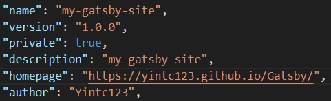
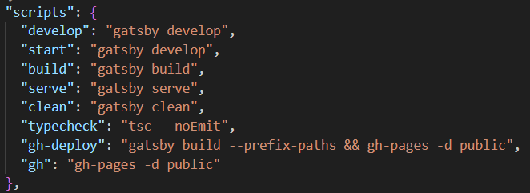
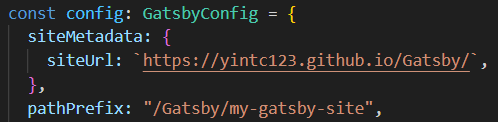

# gh-pages
此套件可以讓使用者於 GitHub Pages 部署自己的靜態網頁專案。
## Setup
- [x] package.json 設置 "homepage"：加入 GitHub Pages 的網址（如下圖）</br>

- [x] package.json 設置 "scripts"：加入一指令 gh-deploy（如下圖）</br>

- [x] gatsby-config.ts 設置 "siteUrl"：加入 GitHub Pages 的網址</br>
- [x] gatsby-config.ts 設置 "pathPrefix"：專案的資料夾（如下圖）</br>


註：
- gatsby build --prefix-paths：prefix-paths 為前綴路徑，如未加上此參數將會從根目錄編譯檔案。
- gh-pages -d <資料夾>：-d 為指定資料夾；資料夾為欲上傳 gh-pages 分支的資料夾。

## Steps
1. 將專案編譯打包並上傳：npm run gh-deploy

## Problem
### Filename too long
問題：執行 gh-pages 的指令時，發生檔案路徑過長導致執行錯誤。
解決：Git 預設僅能處理 260 個字元的檔案名稱（含檔案路徑），設定 Git 讀取長檔案名稱。
```Shell
git config --system core.longpaths true
```
### ENOENT: no such file or directory（.cache）
問題：Gatsby 會依據快取編譯專案以節省編譯時間，避免每一次都重新編譯。
解決：清除快取。
```Shell
gatsby clean
```
## Reference
<ol>
    <li>https://www.gatsbyjs.com/docs/how-to/previews-deploys-hosting/how-gatsby-works-with-github-pages/</li>
    <li>https://stackoverflow.com/questions/22575662/filename-too-long-in-git-for-windows</li>
    <li>https://learn.microsoft.com/en-us/windows/win32/fileio/maximum-file-path-limitation?tabs=registry#enable-long-paths-in-windows-10-version-1607-and-later</li>
    <li>https://www.gatsbyjs.com/docs/debugging-cache-issues/</li>
    <li>https://stackoverflow.com/questions/71099524/why-my-gatsby-build-failed-on-error-enoent-no-such-file-or-directory</li>
</ol>

## <a href="https://yintc123.github.io/Gatsby/">HOME</a>